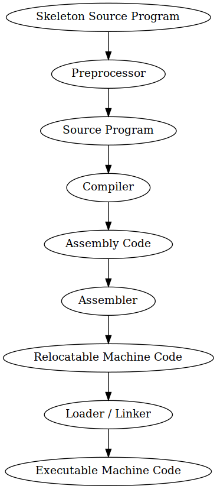
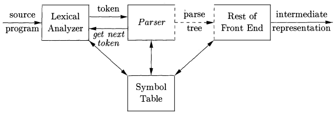
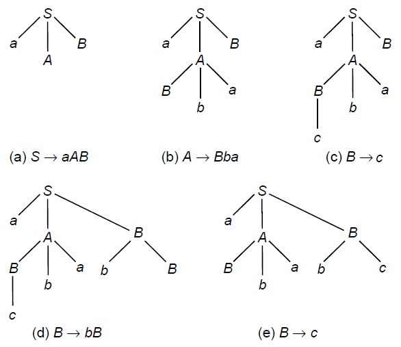

# Introduction to Compilers and Lexical Analysis

## Introduction to Compilers
Programmers write in high level languages for convenience and increased productivity. But these high level languages cannot be directly executed by the computer. We use tools to convert these languages to low level ones.

Compilers are programs that take programs written in one language(preferrably high-level) and converts it into a low-level equivalent for execution.

Alongside conversion it also reports any errors that occur during the transalation process, after reading the whole program.

### Interpreters
Interpreters take the source program and execute it then and there. There is no conversion to intermediate object code. Since it reads it line by line, it has better error reporting.

Since Interpreter has to do the work of reading, parsing and executing the program every time it's much slower than the Compiler.

### Difference between Compilers and Interpreters
| Compiler                                                 | Interpreter                                                          |
|----------------------------------------------------------|----------------------------------------------------------------------|
| Takes entire program as Input                            | Takes single instruction at a time                                   |
| Generates an intermediate object code                    | No intermediate object code is generated                             |
| Conditional control statements are executed faster       | Conditional control statements are executed faster                   |
| Memory requirement is higher as object code is generated | Memory requirement is less as no intermediate object code is present |
| Program needs to be compiled only once                   | Program is converted each and every time it's executed               |
| Errors are displayed after entire program is processed   | Errors are displayed after each instruction                          |
| eg: C, C++ are compiled languages                        | eg: Python, Ruby are interpreted languages                           |

The compiler converts the program while going through different phases of transformations. See +@fig:compilerphases

{#fig:compilerphases}

## Parts of Compilation
There are two phases of compilation. 

* Analysis : Breaks up the source program  into constituent pieces and creates an intermediate representation of source program. 

* Synthesis : Constructs desired target program from the intermediate representation.

### Analysis Phase
#### Lexical Analysis (Linear Analysis)
Lexical Analyser separates characters given in the source language into groups that logically belong together called tokens.

Tokens - Meaningful sequence of characters in source program. eg : keywords, literals, identifiers

* Identifies whether given string or word is accepted in the language.
* Uses regular expression to match words.
* The output of Lexical Analyser is a Stream of tokens which is passed on to th e next phase, the syntax analyser of parser.

#### Syntax Analysis (Heirachial Analysis)
Consumes the Stream of tokens passed by the Lexical Analyser and groups them into syntactic structures.

* Checks whether the statement is acceptable in that language.
* Make use of Context Free Grammer.

# Syntax Analysis and Top Down Parsing
Syntax Analysis is the process of determinig if a string of tokens can be generated by a grammer from an input string.

The input for a Syntax Analyser or Parser is a string of tokens and the output is a parse tree. The parse tree or the syntax tree is tree with leaves representing the string when read from left to right, but with a structure.

### Difference between Lexical Analyser and Parser

| Lexical Analysis                                                          | Syntax Analysis                                                                            |
|---------------------------------------------------------------------------|--------------------------------------------------------------------------------------------|
| Lexical Analysis is simpler as there is no need to preserve the structure | Syntax Analysis is more complex as it requires the structure of the string to be preserved |
| Platform Dependent                                                        | Platform Independent                                                                       |

## Parser
Parsing is the next step in compilation after lexing. Parser takes in the stream of tokens produced by the lexer and then constructs a parse tree based on the supplied grammer. The resulting tree is then passed on for furthur processing.

There are mainly two types of parsing

* __Top Down Parsing__ : Top down parsing constructs the parse tree down from the root to the leaves.
* __Bottom Up Parsing__ : Bottom up parsing constructs the parse tree up from the leavees to the root.

### Role of Parser
The parser takes in the stream of tokens and outputs a parse tree.

* Lexer generates a token from the input string and passes it to the parser
* Parser verifies if the token is valid for the grammer of the language
* It calls the function `getNextToken()` to get another token from the lexer
* It scans all the tokens after receiving them and then constructs the parse tree.
* It checks the syntactic strucuture of the language.

{#fig:parserposition}

## Context Free Grammers
Context Free Grammers (CFG's) are a certain type of formal grammer containing  recursive production rules that describe all possible strings in a given formal language.

A context-free-grammer $G$ is represented by a tuple $G = (V, \Sigma, R, S)$

* $\Sigma$ is a finite set of terminals disjoint from $V$, they make up the actual letters used in the sentence. The set of terminals is the alphabet of the language defined by grammer $G$.
* An alphabet of $V$ of non-terminal symbols or variables.
* $R$ is the set of rewrite rules or productions of the grammer.
* A start symbol $s$ used to represent the whole sentence or program. $s \in V$.

The process of generating valid strings from a grammer is called **Derivation** and the process of validating a string on the given grammer is **Reduction**.

## Derivation Trees
Grammer can be represented as trees. The tree representation of a derivation is called Derivation Trees.

A derivation tree or a parse tree for grammer $G = (V, \Sigma, R, S)$ is a tree with the following properties

* Every vertex is labelled with either a non-terminal or a variable

* The root node is always represented with S
* The internal nodes will always be a variable
* If the vertices $n_1, n_2,\dots , n_k$ with labels $X_1, X_2, \dots, X_k$ are the sons of vertex n with label A, then $A->X_1, X_2, \dots, X_k$ is a production in P.

{#fig:derivationtree width=65%}

### Ambiguity
When the grammer produces more than one parse tree for a given grammer, then the grammer is called as Ambigious.In an ambigious grammer there may be more than one left-most derivation tree or right-most derivation tree.

## Top Down Parsing
In top down parsing the parse tree is first constructed from the root and creating the nodes in preorder.

Top down parsing finds the left most derivation for a given string. Top down parsing is also called **LL()** parsing as it parses the input from left to right performing left most derivation on the sentence.

**Drawbacks of Top Down Parser**

* Infinite Looping : For the grammer $X \rightarrow Xa$ when we expand $X$ we can get into an infinte loop as $X$ again derives $X$.

* Left Recursion : $X \rightarrow Xa$ is an example of a left recursive production where X derives itself recursively and can cause infinite loop.
* Back Tracking Problem: When an errorous input is discovered the parser has to backtrack and delete upto the errorous input. This is complex to implement and error prone.
* Order of Alternatives
* No idea about errors

### Backtracking Parser
The process of repeated scans of the input string is called backtracking. A backtracking parser will pass over the input multiple times to find the left most derivation tree.

### Predictive Parser
It is a tabular representation of recursive descent parser. A predicate parser predicts the next construction in the input string by using look-ahead-token added to the table, these can be used to eliminate backtracking.

{#fig:predictiveparser width=50%}

First and Follow is used to generate the parsing table. 

Tutorial on generating First and Follow [Youtube Tutorial by Ravindrababu Ravula](https://www\.youtube\.com/watch\?v=_uSlP91jmTM)

## Recursive Descent Parsing
It is a type of top down parser that built from a set of mutually recursive procedures where each procedure implements one of the non-terminals of the grammer. It uses this list of recursive procedures to recognize it's input without any backtracking is called recursive descent parsing.

### LL(1) Grammer
LL(1) parser is a table driven parser for left-to-left parsing. The '1' indicates that the grammer uses a look ahead of one source symbol.

## Removing Drawback of Top Down Parsing
### Elimination of Left Recursion
$X \rightarrow Xa$ is an example of a left recursive production where X derives itself recursively and can cause infinite loop.Top down parsers can't handle these type of grammer, hence these recursive rules must be eliminated.

Consider the following grammer $A \rightarrow Aa/b$ , we can eliminate the left recursion by replacing part of production with

\begin{align}
A \rightarrow bA' \\
A' \rightarrow aA'/\epsilon 
\end{align}

# Bottom-Up Parsing

# Syntax Directed Transalation and TypeChecking

# Run-Time Environments and Intermediate Code Generation

# Code Optimization and Code Generation
