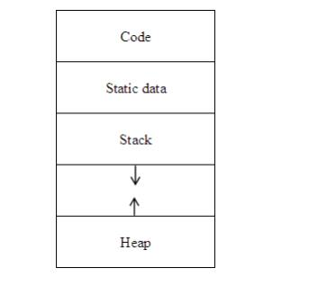
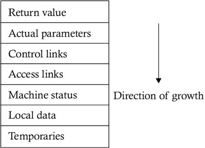

# Introduction to Compilers and Lexical Analysis

## Introduction to Compilers
Programmers write in high level languages for convenience and increased productivity. But these high level languages cannot be directly executed by the computer. We use tools to convert these languages to low level ones.

Compilers are programs that take programs written in one language(preferrably high-level) and converts it into a low-level equivalent for execution.

Alongside conversion it also reports any errors that occur during the transalation process, after reading the whole program.

### Interpreters
Interpreters take the source program and execute it then and there. There is no conversion to intermediate object code. Since it reads it line by line, it has better error reporting.

Since Interpreter has to do the work of reading, parsing and executing the program every time it's much slower than the Compiler.

### Difference between Compilers and Interpreters
| Compiler                                                 | Interpreter                                                          |
|----------------------------------------------------------|----------------------------------------------------------------------|
| Takes entire program as Input                            | Takes single instruction at a time                                   |
| Generates an intermediate object code                    | No intermediate object code is generated                             |
| Conditional control statements are executed faster       | Conditional control statements are executed faster                   |
| Memory requirement is higher as object code is generated | Memory requirement is less as no intermediate object code is present |
| Program needs to be compiled only once                   | Program is converted each and every time it's executed               |
| Errors are displayed after entire program is processed   | Errors are displayed after each instruction                          |
| eg: C, C++ are compiled languages                        | eg: Python, Ruby are interpreted languages                           |

The compiler converts the program while going through different phases of transformations. See +@fig:compilerphases

{#fig:compilerphases}


## Parts of Compilation
There are two phases of compilation. 

* Analysis : Breaks up the source program  into constituent pieces and creates an intermediate representation of source program. 

* Synthesis : Constructs desired target program from the intermediate representation.

### Analysis Phase
#### Lexical Analysis (Linear Analysis)
Lexical Analyser separates characters given in the source language into groups that logically belong together called tokens.

Tokens - Meaningful sequence of characters in source program. eg : keywords, literals, identifiers

* Identifies whether given string or word is accepted in the language.
* Uses regular expression to match words.
* The output of Lexical Analyser is a Stream of tokens which is passed on to th e next phase, the syntax analyser of parser.

#### Syntax Analysis (Heirachial Analysis)
Consumes the Stream of tokens passed by the Lexical Analyser and groups them into syntactic structures.

* Checks whether the statement is acceptable in that language.
* Make use of Context Free Grammer.

# Syntax Analysis and Top Down Parsing
Syntax Analysis is the process of determinig if a string of tokens can be generated by a grammer from an input string.

The input for a Syntax Analyser or Parser is a string of tokens and the output is a parse tree. The parse tree or the syntax tree is tree with leaves representing the string when read from left to right, but with a structure.

### Difference between Lexical Analyser and Parser

| Lexical Analysis                                                          | Syntax Analysis                                                                            |
|---------------------------------------------------------------------------|--------------------------------------------------------------------------------------------|
| Lexical Analysis is simpler as there is no need to preserve the structure | Syntax Analysis is more complex as it requires the structure of the string to be preserved |
| Platform Dependent                                                        | Platform Independent                                                                       |

## Parser
Parsing is the next step in compilation after lexing. Parser takes in the stream of tokens produced by the lexer and then constructs a parse tree based on the supplied grammer. The resulting tree is then passed on for furthur processing.

There are mainly two types of parsing

* __Top Down Parsing__ : Top down parsing constructs the parse tree down from the root to the leaves.
* __Bottom Up Parsing__ : Bottom up parsing constructs the parse tree up from the leavees to the root.

### Role of Parser
The parser takes in the stream of tokens and outputs a parse tree.

* Lexer generates a token from the input string and passes it to the parser
* Parser verifies if the token is valid for the grammer of the language
* It calls the function `getNextToken()` to get another token from the lexer
* It scans all the tokens after receiving them and then constructs the parse tree.
* It checks the syntactic strucuture of the language.

{#fig:parserposition}

## Context Free Grammers
Context Free Grammers (CFG's) are a certain type of formal grammer containing  recursive production rules that describe all possible strings in a given formal language.

A context-free-grammer $G$ is represented by a tuple $G = (V, \Sigma, R, S)$

* $\Sigma$ is a finite set of terminals disjoint from $V$, they make up the actual letters used in the sentence. The set of terminals is the alphabet of the language defined by grammer $G$.
* An alphabet of $V$ of non-terminal symbols or variables.
* $R$ is the set of rewrite rules or productions of the grammer.
* A start symbol $s$ used to represent the whole sentence or program. $s \in V$.

The process of generating valid strings from a grammer is called **Derivation** and the process of validating a string on the given grammer is **Reduction**.

## Derivation Trees
Grammer can be represented as trees. The tree representation of a derivation is called Derivation Trees.

A derivation tree or a parse tree for grammer $G = (V, \Sigma, R, S)$ is a tree with the following properties

* Every vertex is labelled with either a non-terminal or a variable

* The root node is always represented with S
* The internal nodes will always be a variable
* If the vertices $n_1, n_2,\dots , n_k$ with labels $X_1, X_2, \dots, X_k$ are the sons of vertex n with label A, then $A->X_1, X_2, \dots, X_k$ is a production in P.

{#fig:derivationtree width=65%}

### Ambiguity
When the grammer produces more than one parse tree for a given grammer, then the grammer is called as Ambigious.In an ambigious grammer there may be more than one left-most derivation tree or right-most derivation tree.

## Top Down Parsing
In top down parsing the parse tree is first constructed from the root and creating the nodes in preorder.

Top down parsing finds the left most derivation for a given string. Top down parsing is also called **LL()** parsing as it parses the input from left to right performing left most derivation on the sentence.

**Drawbacks of Top Down Parser**

* Infinite Looping : For the grammer $X \rightarrow Xa$ when we expand $X$ we can get into an infinte loop as $X$ again derives $X$.

* Left Recursion : $X \rightarrow Xa$ is an example of a left recursive production where X derives itself recursively and can cause infinite loop.
* Back Tracking Problem: When an errorous input is discovered the parser has to backtrack and delete upto the errorous input. This is complex to implement and error prone.
* Order of Alternatives
* No idea about errors

### Backtracking Parser
The process of repeated scans of the input string is called backtracking. A backtracking parser will pass over the input multiple times to find the left most derivation tree.

### Predictive Parser
It is a tabular representation of recursive descent parser. A predicate parser predicts the next construction in the input string by using look-ahead-token added to the table, these can be used to eliminate backtracking.

{#fig:predictiveparser width=50%}

First and Follow is used to generate the parsing table. 

Tutorial on generating First and Follow [Youtube Tutorial by Ravindrababu Ravula](https://www\.youtube\.com/watch\?v=_uSlP91jmTM)

## Recursive Descent Parsing
It is a type of top down parser that built from a set of mutually recursive procedures where each procedure implements one of the non-terminals of the grammer. It uses this list of recursive procedures to recognize it's input without any backtracking is called recursive descent parsing.

### LL(1) Grammer
LL(1) parser is a table driven parser for left-to-left parsing. The '1' indicates that the grammer uses a look ahead of one source symbol.

## Removing Drawback of Top Down Parsing
### Elimination of Left Recursion
$X \rightarrow Xa$ is an example of a left recursive production where X derives itself recursively and can cause infinite loop.Top down parsers can't handle these type of grammer, hence these recursive rules must be eliminated.

Consider the following grammer $A \rightarrow Aa/b$ , we can eliminate the left recursion by replacing part of production with

\begin{align}
A \rightarrow bA' \\
A' \rightarrow aA'/\epsilon 
\end{align}

# Bottom-Up Parsing
Bottom Up parsing is a parsing technique in which the parsing tree is constructed beginning at the bottom and then working upwards.

## Shift Reduce Parsing
It is a form of bottom up parsing in which a stack holds the non terminals and an input buffer holds the string to be parsed. It is used to create a parse tree beginning at the bottom working to the top.

At each reduction the symbols on the right side are reduced by the symbols on t
he left side of the production.

\begin{align}
S &\rightarrow aABe \\
A &\rightarrow Abc / b \\
B &\rightarrow d 
\end{align}


The sentence abbcde can be reduced by

\begin{align}
abbcde \\
aAbcde &\because A \rightarrow b \\
aAde &\because A \rightarrow Abc \\
aABe &\because B \rightarrow d \\
S &\because S \rightarrow aABe 
\end{align}

Reduction : Each replacement of the right side by the corresponding left side is called reduction.

__Handle__ : The right hand side string which is reduced by the corresponding left side production is called handle. In the reduction $aAbcde \because A \rightarrow b$ b is the handle.

### Stack Implementation of Shift Reduce Parsing
Shift Reduce Parsing is commonly implemented using a Stack with starting symbol \$ and input buffer.

There are four possible actions the parser can make

1. Shift : The next input symbol is pushed on top of the stack

2. Reduce : The handle at the top of the stack is replaced with the correspoding non-terminal
3. Accept : The parser has completed the parsing and the given string is accepted
4. Error: The parser encounters a syntax error and calls the error recoverty routine.

### Handle Pruning

## Operator Precedence Parsing
It is a method of Shift Reduce Parsing that only works on subset of context free grammers called operator grammers.

An operator grammer must satifsy the following properties 

1. The right hand side of the productions does not contain an $\epsilon$
2. No two non-terminals are adjacent

### Operator Precedence Parsing Algorithm
Input : The precedence relations from some operator-precedence grammer and input string of terminals from that grammer.

```{.numberLines}
repeat forever
  if only  $ is on the stack and only $ is on the input
    accept and break
  else 
    begin
      let a be the topmost terminal symbol, b the current input symbol
      if a < b or a = b then 
        begin
          push b on the stack
        end
      else if a > b then
        repeat pop the stack
          until the top stack terminal is related by < 
          to the terminal most recently popped
      else call error correcting code
  end
```

## LR Parsing
LR parsing is a type of bottom up parsing used to parse a large number of grammers. LR scans the input stream from left to right and constructs the right most derivation in reverse.

{#fig:lrparser width=40%}

### LR Parsing Algorithm

### Advantages and Disadvantages of LR Parser

### Difference between LL and LR Parsers

### SLR
SLR refers to Simple LR parsing. It is the same as LR(0), the difference being the way the table is generated. It only performs the reduction with the grammer rule $A \rightarrow w$ if the next symbol in the input string is follow set of A.

### Canonical LR Parser

### LALR Parsing 

# Syntax Directed Transalation and TypeChecking

# Run-Time Environments and Intermediate Code Generation
Run Time Environment is a state of the target machine, which may include libraries, enviroment variables to provide services to the processes in execution.

## Source Language Issues
A program consist of procedures, a procedure definition is a declaration that, in its simplest form, associates an identifier (procedure name) with a statement (body of the procedure).  Each execution of procedure is referred to as an activation of the procedure. Lifetime of an activation is the sequence of steps present in the execution of the procedure.

### Activation Trees
Each execution of the procedure body is termed as an activation of the procedure. The lifetime of a procedure is the steps between the start and the end of the procedure.

We can use an Activation Tree to depict the flow of control enters and leaves activation.

1. Each node represents an activation of a procedure.
2. The root represents the activation of the main program.
3. A node x can only be the parent of another node y if and only if the control passes from x to y.
4. Nodes to the left of another node should complete it's lifetime before the ones on the right.

Consider the given program
``` c
printf(“Enter Your Name: “);
scanf(“%s”, username);
show_data(username);
printf(“Press any key to continue…”);
. . .
int show_data(char *user) {
   printf(“Your name is %s”, username);
   return 0;
}
```

The corresponding activation tree is 

{#fig:activationtree width=60%}

### Scope of Declaration
A declaration in a language is a syntactic construct that associates information with a name. The portion of the program which the declaration applies is called the scope of the declaration.


### Binding of Names
The enviroment is a function which maps a name to a storage location. Each name declared in the program may denote different data objects at runtime.

An assignement changes state but not the enviroment. When the enviroment associates a storage location S with a name say X, we say X is bound to S.


## Storage Organisation
The memory of program is subdivided into different parts to hold

1. Generated target code
2. Data object
3. Counter part of control stack to keep track of procedure activation

Since the size of target code is known at runtime it is placed in a statically determined area. Data objects known at compile time are also kept in the static data section.

When a function call occurs, execution of the parent activation is interrupted and information about status of machine is pushed on to the Stack. 

A separate area of runtime memory is called a heap, holds all other information and dynamic data allocations

{#fig:storageorganisation height=30%}

### Activation Record
The information needed by a single execution of a procedure or activation is stored in a continguous block of storage called a activation record or frame. See @fig:activationrecord

{#fig:activationrecord height=20%}

## Storage Allocation Strategies
The different storage allocation strategies are :

1. Static allocation - lays out storage for all data objects at compile time
2. Stack allocation - manages the run-time storage as a stack.
3. Heap allocation - allocates and deallocates storage as needed at run time from a data area known as heap.

### Static Allocation

In static allocation, names are bound to storage as the program is compiled, so there is no need for a run-time support package. Since the bindings do not change at run-time, everytime a procedure is activated, its names are bound to the same storage locations. Therefore values of local names are retained across activations of a procedure.

From the type of a name, the compiler decides the amount of storage for the name and decides where the activation records go. At compile time, we can fill in the addresses at which the target code can find the data it operates on.

### Stack Allocation

All compilers for languages that use procedures, functions or methods as units of user-defined actions manage at least part of their run-time memory as a stack. Each time a procedure is called , space for its local variables is pushed onto a stack, and when the procedure terminates, that space is popped off the Stack.

__Calling sequences__: Procedures called are implemented in what is called as calling sequence, which consists of code that allocates an activation record on the stack and enters information into its fields. A return sequence is similar to code to restore the state of machine so the calling procedure can continue its execution after the call. The code in calling sequence is often divided between the calling procedure (caller) and the procedure it calls (callee).

### Heap Allocation
Heap allocation allocates contiguous storage as needed for activation records or other data objects.

## Intermediate Code Generation
The front end of the compiler transaltes the source program into an internal intermediate representation from which the backend generates specific target code.
 
The benefits of using this artitecture is 
1. The code can be compiled for a new machine artitecture by only porting the backend that generates the specific machine dependent code.
2. A machine independent optimizer can be applied to the intermediate representation.

### Syntax Tree DAG
A syntax tree depicts the natural hierarchical structure of a source program. A dag (Directed Acyclic Graph) gives the same information but in a more compact way because common subexpressions are identified. 

The syntax tree of the expression $a := b * - c + b * - c$

{#fig:syntaxtreedag}

### Postfix Notation
Postfix notation is a lineraized representation of a syntax tree, it is a list of nodes in which a node appears immediately after it's children.

### Three Address Code
Three-address code is a sequence of statements of the general form $x := y\ op\ z$ , where x, y and z are names, constants, or compiler-generated temporaries; op stands for any operator, such as a fixed- or floating-point arithmetic operator, or a logical operator on boolean-valued data. Thus a source language expression like $x+y*z$ might be translated into a sequence

\begin{align}
t1 &:= y * z \\
t2 &:= x + t1
\end{align}

where t1 and t2 are compiler-generated temporary names.
 
# Code Optimization and Code Generation
