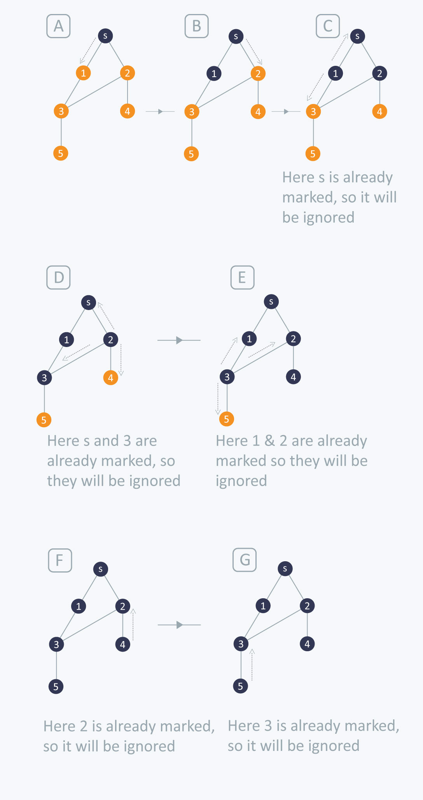

# Algorithm Analysis Techniques 
## Syllabus
Introduction to Algorithm AnalysisTime and Space Complexity-
Elementary operations and Computation of Time Complexity-
Best, worst and Average Case Complexities- Complexity

Calculation of simple algorithms
Recurrence Equations:Solution of Recurrence Equations –
Iteration Method and Recursion Tree Methods

## Algorithm
An Algorithm is a finite set of instructions which if followed accomplishes a particular task.

### Criteria 
* **Input**: The algorithm must have some quantities externally supplied
* **Output**: The algorithm must produce atleast one output
* **Definitness**: Each instruction must be clear and unambigous
* **Finiteness**: Algorithm must terminate after a finite number of steps
* **Effectiveness**: Every instruction must be sufficiently basic that we can do with pen and paper if neccessary.

## Complexity Analysis
Algorithms can be tested in a lot of ways. They can be tested for logical correctness by tracing it's execution for a sample input space.

### Space Complexity
It's the amount of space required by the program or the algorithm to run to it's completion and provide an output. 

Space Complexity is computed as the sum of two parts.

1. Fixed part which includes the part for variables, code and constants. 
2. Dynamic part which accounts for the memory allocated during run-time like initializing array dynamically. 

$S(p)$ is the space complexity of the program
$$
  S(p) = C + Sp(instance\ characteristics)
$$

### Time Complexity
Time complexity measures the running time of an algorithm to produce a viable output. Time complexity is preferred over Space complexity. It is given as a function of the input $n$.

#### Time Complexity Calculation using Elementary Operations
Time complexity of the program with input $n$ can be calculated by adding up time complexities of the elementary operations.

$$
  t_p(n)=C_aADD(n)+C_sSUB(n)+C_mMUL(n)+C_dDIV(n)
$$

where $C_a$ is the constant time for an addition operation and $ADD(n)$ is the number of addition operations. This method although simple is not effective as the time required depends on type and size of operands.

## Orders of Growth
Measuring the performance of an algorithm in relation with it's i/p size h is called it's orders of growth. It's much easier to calculate and gives the relative performance difference between algorithms.

Consider this algorithm for calculating the product of two matrices
```
for i=1 to n
  for j=1 to n
    for k=1 to n
      c[i][j] = a[i][j] * b[k][j]
```

## Asymptotic Notation
The main idea of asymptotic analysis is to have a measure of efficiency of algorithms that doesn’t depend on machine specific constants, and doesn’t require algorithms to be implemented and time taken by programs to be compared. 

It measures the growth rate of algorithms w.r.t to its input size.

* Big Oh $O$
* Big Omega $\Omega$
* Big Theta $\Theta$

### Big Oh $O$
Big O notation is used in Computer Science to describe the performance or complexity of an algorithm. Big O specifically describes the worst-case scenario, and can be used to describe the execution time required or the space used (e.g. in memory or on disk) by an algorithm.

$$f(n) = O(g(n))$$

if there exists +ve constants $c$ and $n_0$ such that $f(n) \leq c \cdot g(n)$ for all the values of n greater than some $n_0$. c is any constant

### Big Omega $\Omega$
Sometimes, we want to say that an algorithm takes at least a certain amount of time, without providing an upper bound. We use big-$\Omega$ notation; that's the Greek letter "omega."

If a running time is $\Omega(f(n))$, then for large enough $n$, the running time is at least $k \cdot f(n)$  for some constant $k$. 

### Big Theta $\Theta$
 Big Omega tells us the lower bound of the runtime of a function, and Big O tells us the upper bound. Often times, they are different and we can’t put a guarantee on the runtime - it will vary between the two bounds and the inputs. But what happens when they’re the same? Then we can give a theta $(\Theta)$ bound - our function will run in that time, no matter what input we give it. 
 
 In general, we always want to give a theta bound if possible because it is the most accurate and tightest bound. If we can’t give a theta bound, the next best thing is the tightest O bound possible.

For an algorithm there are three cases

* Worst Case : It is the maximum time taken by an algorithm to run to it's completion, denoted by $O$.

* Best Case : It is the minimum time taken by an algorithm to run to it's completion, denoted by $\Omega$.

* Average Case : It is the average time taken by an algorithm to run to it's completion, denoted by $\Theta$.

### Linear Search
Consider the algorithm for Linear Search

```
  for(i=0; i<n; ++i) {
    if a[i] == key
      element found
      break
  }
```
Let us consider the different cases that might occur when we search for an element in a string using linear search

* Element is first in the list :The algorithm finishes in constant time of 1

* Element is last in the list : The algorithm goes through the entire list and the complexity grows linearly with the input

* Element is at a random position 

\begin{align}
Best\ Case &= \Theta(1) \\
Worst\ Case &= O(n) \\
Average\ Case &= \frac{1+2+3+\dots+n+n}{n+1} \\
              &= \frac{n+n\frac{(n+1)}{2}}{n+1} = \Theta(n) \\
              &= \frac{n}{n+1} + \frac{n}{2} \\
              &= \Theta(n)
\end{align}


# Graphs
Graphs are representations of set of objects called **vertices** connected by links called **edges**. It can either be directed(where on edge can only connect two vertices in one way** or undirected.

A Weighted graph is a graph where each edges have corresponding weights.

### Representation of Graphs
**Adjacency Matrix** : The adjacency matrix representation of a graph G with n vertices is an nxn matrix AG such that each entry $a_{ij}$ corresponds to the number of edges connecting vertices $v_i$ and $v_j$.

- $a_{ij}$ is 0 when no edges
- If G has no self loops then main diagonal will only have zeroes
- If G has no parallel edges then all elements will either be zero or one.

{#fig:adjacencymatrix width=50%}

**Adjacency List** : In this representation each row of the adjacency matrix is represented as a linked list for each vertex. The nodes in each list represent the vertices adjacent to the given vertex.

**Adjacency Multilist** : In this representation the edge connecting $V_i$ and $V_j$ are represented by two entries in each list for $V_i$ and $V_j$.

**Path Matrix** : A path matrix is defined for a pair of vertices $(x, y)$, where the row contains different paths between vertices x and y, and columns corresponds to edges in G.

\begin{equation}
    P_{ij}=
    \begin{cases}
      1, & \text{if path between vi and vj} \\
      0, & \text{otherwise}
    \end{cases}
\end{equation}

## Graph Traversal
Graph Traversl refers to the process of visiting each vertex in a graph. Graph Traversal has many applications. The order in which the edges are traversed are decided by the algorithm.

### Depth First Search Algorithm
In DFS traversal the nodes are visited in such a way as to form the longest path from the starting vertex. When a dead end is reached the algorithm backtracks and adds branches as long as possible. It uses a stack to store the vertices of the graph.

DFS is generisation of preorder traversal. The starting vertex can be chosen arbitarily.

A dead end is an vertex where all the neighbouring vertices have been visited, we then back up along the last edge and branch out in another direction.

**Algorithm**

1. Choose arbitary node, designate as search node and mark as visited.

2. From the adjacency matrix, find a node adjacent to the search node that has not yet been visited and mark as visited search node.

3. Repeat Step 2 using the new search node. When there are no remaining nodes satisfying Step 2, back track to previous search node and continue.

4. When return to previous search node is not possible, the search from original chosen node is complete.

5. If unvisited nodes are remaining, choose any unvisited nodes and repeat Step 1 to Step 4.

6. Stop

**Time Complexity** : The time taken to determine the adjacent vertices from an adjacency matrix is $O(n)$. Since at most n vertices are visited, the total time complexity is $O(n^2)$.

{#fig:dfs width=80%}

### Breadth First Search - BFS
In BFS the idea is to select first a root vertex $V_i$ visit all it's adjacent vertices, then the ones that are adjacent to the adjacent vertices of $V_i$ that has not yet been visited.

The graph is searched breadth wise and a queue is the convienent data structure to keep track of visited nodes.

**Algorithm**

1. Start with any vertex and mark as visited.

2. Using the adjacency matrix, find a vertex adjacent to the vertex in step 1, Mark as visited.

3. Return to vertex in Step 1, move along edge towards an unvisited vertex, and mark the new vertex as visited.

4. Repeat step 3 until all vertices adjacent to the vertex has been marked as visited.

5. Repeat Step 1 through Step 4 starting from the vertex visited in Step 2 , then starting from the nodes visited to Step 3 in the order visited. If all vertices have been visited, then continue to the next step.

5. Stop

**Time Complexity** : The queue is used exactly once by each vertex hence $n$ times. If an adjacency matrix is use then the for loop takes another $O(n)$ time for each vertex. The time complexity becomes $O(n^2)$.

Example {@fig:bfs}

{#fig:bfs}

# Greedy Strategy
## Minimal Cost Spanning Tree Computation
Consider a Graph $G(V, E)$, a Spanning Tree is a Tree that contains all the vertices of G. It has no cycles, no self-loops and no parallel edges and should be minimally connected, for n vertices there should only be n-1 edges

A Minimal Cost Spanning Tree is a tree where the sum of edges is minimum.

### Prim's Algorithm
Prim's Algorithm is a greedy algorithm that when given a weighted Graph=G(V,E) would output the corresponding Minimum Cost Spanning Tree.

**Algorithm**
```
MST-PRIM(G, w, r) 
  Q <- V[G]

  for each u element of Q
    do key[u] <- infinity
  key[r] <- 0
  pi[r] <- NULL
  
  while Q is not NULL
    do u <- EXTRACT_MIN(Q)
      for each v in Adj[u]
        do if v in Q and w(u, v) < key[v]
          then pi[v] <- u
            key[v] <- w(u, v)
```
It is an extension of the generic approach where each vertex is added progressively. 

{#fig:primsalgo height=60%}


**Working of the Algorithm**

* lines 1-3) All nodes are placed in Q (the set of nodes not in the tree), their parents are declared to be NIL, and their key (i.e. minimum distance to the existing tree along a single edge) is set to infinity

* (line 4) The key of the root node (node a) is set to 0

* (line 6) The node u with minimum key (which is the root node a) is removed from Q and added to the tree

* (lines 8-11) The keys of nodes b and h are updated to 4 and 8, and pi(b) and pi(h) are set to u (but b and h are not extracted from Q). This completes step (a)

* (line 6) The node u with minimum key (which is now node b, with key=4) is removed from Q and added to the tree via its parent (which is pi(b)=a)

* (lines 8-11) The key of nodes c is updated to 8, and pi(c) is set to b. Since key(h)=8 is smaller than 11=w(b,h), the key and parent of h are not updated. This completes step (b)

* (line 6) The node u with minimum key (node c, with key=8, but it could also have been node h, which also has key=8) is removed from Q and added to the tree via its parent (which is pi(c)=b)

* (lines 8-11) Update keys and parents of nodes d, i, and f, completing step (c)

The performance of Prim’s algorithm depends on how we implement the minpriority queue Q. If Q is implemented as a binary min-heap, we can use the BUILD-MIN-HEAP procedure to perform the initialization in lines 1-5 in O(V) time. The body of the while loop is executed $|V|$ times, and since each EXTRACT-MIN operation takes $|O(lg V)|$ time, the total time for all calls to EXTRACT-MIN is $|O(V lgV)|$. The for loop in lines 8-11 is executed $O(E)$ times altogether, since the sum of the lengths of all adjacency lists is $2|E|$. Within the for loop, the test for membership in Q in line 9 can be implemented in constant time by keeping a bit for each vertex that tells whether or not it is in Q, and updating the bit when the vertex is removed from Q. The assignment in line 11 involves an implicit DECREASE-KEY operation on the min-heap, which can be implemented in a binary min-heap in $O(lg V)$ time. Thus, the total time for Prim’s algorithm is $O(VlgV + ElgV) = O(ElgV)$, which is asymptotically the same as for our implementation of Kruskal’s algorithm.

The asymptotic running time of Prim’s algorithm can be improved, however,
by using Fibonacci heaps. if $|V|$ elements are organized
into a Fibonacci heap, we can perform an EXTRACT-MIN operation in $|O(lg V)|$
amortized time and a DECREASE-KEY operation (to implement line 11) in $O(1)$
amortized time. Therefore, if we use a Fibonacci heap to implement the minpriority queue Q, the running time of Prim’s algorithm improves to $O(E + VlgV)$.
