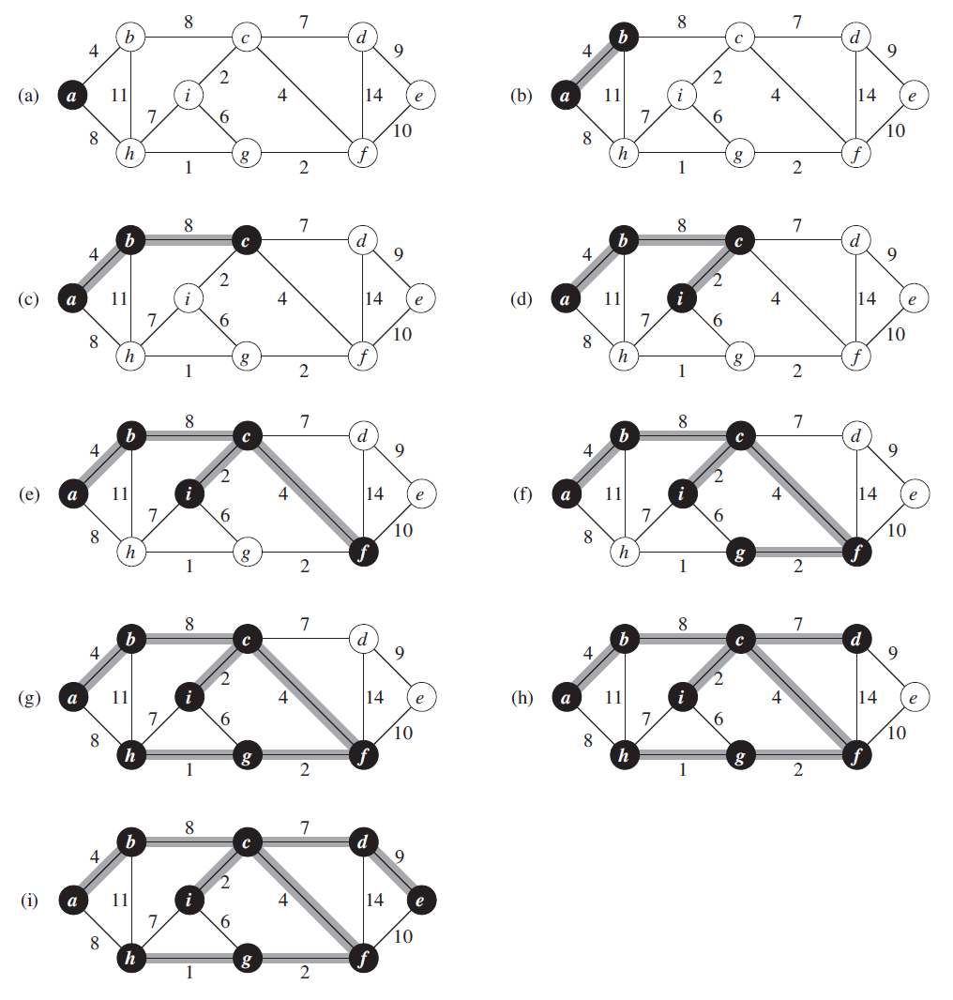

# Algorithm Analysis Techniques 
## Syllabus
Introduction to Algorithm AnalysisTime and Space Complexity-
Elementary operations and Computation of Time Complexity-
Best, worst and Average Case Complexities- Complexity

Calculation of simple algorithms
Recurrence Equations:Solution of Recurrence Equations –
Iteration Method and Recursion Tree Methods

## Algorithm
An Algorithm is a finite set of instructions which if followed accomplishes a particular task.

### Criteria 
* **Input**: The algorithm must have some quantities externally supplied
* **Output**: The algorithm must produce atleast one output
* **Definitness**: Each instruction must be clear and unambigous
* **Finiteness**: Algorithm must terminate after a finite number of steps
* **Effectiveness**: Every instruction must be sufficiently basic that we can do with pen and paper if neccessary.

## Complexity Analysis
Algorithms can be tested in a lot of ways. They can be tested for logical correctness by tracing it's execution for a sample input space.

### Space Complexity
It's the amount of space required by the program or the algorithm to run to it's completion and provide an output. 

Space Complexity is computed as the sum of two parts.

1. Fixed part which includes the part for variables, code and constants. 
2. Dynamic part which accounts for the memory allocated during run-time like initializing array dynamically. 

$S(p)$ is the space complexity of the program
$$
  S(p) = C + Sp(instance\ characteristics)
$$

### Time Complexity
Time complexity measures the running time of an algorithm to produce a viable output. Time complexity is preferred over Space complexity. It is given as a function of the input $n$.

#### Time Complexity Calculation using Elementary Operations
Time complexity of the program with input $n$ can be calculated by adding up time complexities of the elementary operations.

$$
  t_p(n)=C_aADD(n)+C_sSUB(n)+C_mMUL(n)+C_dDIV(n)
$$

where $C_a$ is the constant time for an addition operation and $ADD(n)$ is the number of addition operations. This method although simple is not effective as the time required depends on type and size of operands.

## Orders of Growth
Measuring the performance of an algorithm in relation with it's i/p size h is called it's orders of growth. It's much easier to calculate and gives the relative performance difference between algorithms.

Consider this algorithm for calculating the product of two matrices
```
for i=1 to n
  for j=1 to n
    for k=1 to n
      c[i][j] = a[i][j] * b[k][j]
```

## Asymptotic Notation
The main idea of asymptotic analysis is to have a measure of efficiency of algorithms that doesn’t depend on machine specific constants, and doesn’t require algorithms to be implemented and time taken by programs to be compared. 

It measures the growth rate of algorithms w.r.t to its input size.

* Big Oh $O$
* Big Omega $\Omega$
* Big Theta $\Theta$

### Big Oh $O$
Big O notation is used in Computer Science to describe the performance or complexity of an algorithm. Big O specifically describes the worst-case scenario, and can be used to describe the execution time required or the space used (e.g. in memory or on disk) by an algorithm.

$$f(n) = O(g(n))$$

if there exists +ve constants $c$ and $n_0$ such that $f(n) \leq c \cdot g(n)$ for all the values of n greater than some $n_0$. c is any constant

### Big Omega $\Omega$
Sometimes, we want to say that an algorithm takes at least a certain amount of time, without providing an upper bound. We use big-$\Omega$ notation; that's the Greek letter "omega."

If a running time is $\Omega(f(n))$, then for large enough $n$, the running time is at least $k \cdot f(n)$  for some constant $k$. 

### Big Theta $\Theta$
 Big Omega tells us the lower bound of the runtime of a function, and Big O tells us the upper bound. Often times, they are different and we can’t put a guarantee on the runtime - it will vary between the two bounds and the inputs. But what happens when they’re the same? Then we can give a theta $(\Theta)$ bound - our function will run in that time, no matter what input we give it. 
 
 In general, we always want to give a theta bound if possible because it is the most accurate and tightest bound. If we can’t give a theta bound, the next best thing is the tightest O bound possible.

For an algorithm there are three cases

* Worst Case : It is the maximum time taken by an algorithm to run to it's completion, denoted by $O$.

* Best Case : It is the minimum time taken by an algorithm to run to it's completion, denoted by $\Omega$.

* Average Case : It is the average time taken by an algorithm to run to it's completion, denoted by $\Theta$.

### Linear Search
Consider the algorithm for Linear Search

```
  for(i=0; i<n; ++i) {
    if a[i] == key
      element found
      break
  }
```
Let us consider the different cases that might occur when we search for an element in a string using linear search

* Element is first in the list :The algorithm finishes in constant time of 1

* Element is last in the list : The algorithm goes through the entire list and the complexity grows linearly with the input

* Element is at a random position 

\begin{align}
Best\ Case &= \Theta(1) \\
Worst\ Case &= O(n) \\
Average\ Case &= \frac{1+2+3+\dots+n+n}{n+1} \\
              &= \frac{n+n\frac{(n+1)}{2}}{n+1} = \Theta(n) \\
              &= \frac{n}{n+1} + \frac{n}{2} \\
              &= \Theta(n)
\end{align}


# Module V
## Minimal Cost Spanning Tree Computation
Consider a Graph $G(V, E)$, a Spanning Tree is a Tree that contains all the vertices of G. It has no cycles, no self-loops and no parallel edges and should be minimally connected.

A Minimal Cost Spanning Tree is a tree where the sum of edges is minimum.

### Prim's Algorithm
Prim's Algorithm is a greedy algorithm that when given a weighted Graph=G(V,E) would output the corresponding Minimum Cost Spanning Tree.

**Algorithm**
```
MST-PRIM(G, w, r) 
  Q <- V[G]

  for each u element of Q
    do key[u] <- infinity
  key[r] <- 0
  pi[r] <- NULL
  
  while Q is not NULL
    do u <- EXTRACT_MIN(Q)
      for each v in Adj[u]
        do if v in Q and w(u, v) < key[v]
          then pi[v] <- u
            key[v] <- w(u, v)
```
In Prim's algorithm The priority Queue Q is initialized to contain all the vertices and to set the key of each vertex to $\infty$, except for the root r, whose key is set to 0. Then 

{#fig:primsalgo height=60%}
