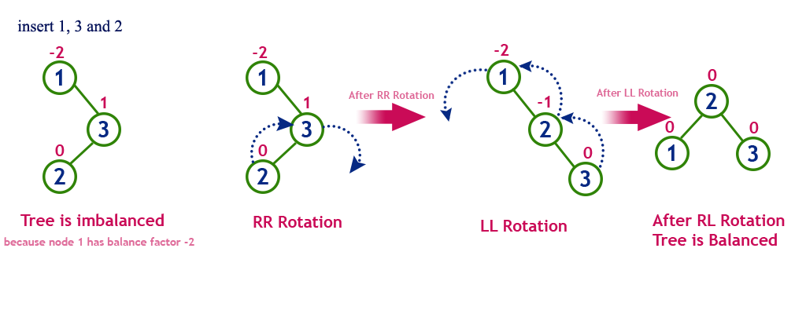
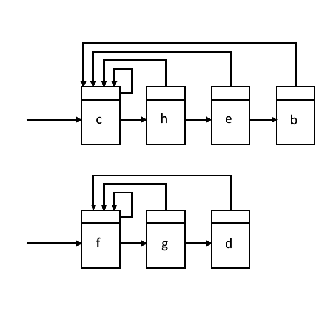
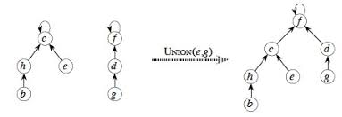

# Algorithm Analysis Techniques 
## Algorithm
An Algorithm is a finite set of instructions which if followed accomplishes a particular task.

### Criteria 
* **Input**: The algorithm must have some quantities externally supplied
* **Output**: The algorithm must produce atleast one output
* **Definitness**: Each instruction must be clear and unambigous
* **Finiteness**: Algorithm must terminate after a finite number of steps
* **Effectiveness**: Every instruction must be sufficiently basic that we can do with pen and paper if neccessary.

## Complexity Analysis
Algorithms can be tested in a lot of ways. They can be tested for logical correctness by tracing it's execution for a sample input space.

### Space Complexity
It's the amount of space required by the program or the algorithm to run to it's completion and provide an output. 

Space Complexity is computed as the sum of two parts.

1. Fixed part which includes the part for variables, code and constants. 
2. Dynamic part which accounts for the memory allocated during run-time like initializing array dynamically. 

$S(p)$ is the space complexity of the program
$$
  S(p) = C + Sp(instance\ characteristics)
$$

### Time Complexity
Time complexity measures the running time of an algorithm to produce a viable output. Time complexity is preferred over Space complexity. It is given as a function of the input $n$.

#### Time Complexity Calculation using Elementary Operations
Time complexity of the program with input $n$ can be calculated by adding up time complexities of the elementary operations.

$$
  t_p(n)=C_aADD(n)+C_sSUB(n)+C_mMUL(n)+C_dDIV(n)
$$

where $C_a$ is the constant time for an addition operation and $ADD(n)$ is the number of addition operations. This method although simple is not effective as the time required depends on type and size of operands.

## Orders of Growth
Measuring the performance of an algorithm in relation with it's i/p size h is called it's orders of growth. It's much easier to calculate and gives the relative performance difference between algorithms.

Consider this algorithm for calculating the product of two matrices
```
for i=1 to n
  for j=1 to n
    for k=1 to n
      c[i][j] = a[i][j] * b[k][j]
```

## Asymptotic Notation
The main idea of asymptotic analysis is to have a measure of efficiency of algorithms that doesn’t depend on machine specific constants, and doesn’t require algorithms to be implemented and time taken by programs to be compared. 

It measures the growth rate of algorithms w.r.t to its input size.

* Big Oh $O$
* Big Omega $\Omega$
* Big Theta $\Theta$

### Big Oh $O$
Big O notation is used in Computer Science to describe the performance or complexity of an algorithm. Big O specifically describes the worst-case scenario, and can be used to describe the execution time required or the space used (e.g. in memory or on disk) by an algorithm.

$$f(n) = O(g(n))$$

if there exists +ve constants $c$ and $n_0$ such that $f(n) \leq c \cdot g(n)$ for all the values of n greater than some $n_0$. c is any constant

### Big Omega $\Omega$
Sometimes, we want to say that an algorithm takes at least a certain amount of time, without providing an upper bound. We use big-$\Omega$ notation; that's the Greek letter "omega."

If a running time is $\Omega(f(n))$, then for large enough $n$, the running time is at least $k \cdot f(n)$  for some constant $k$. 

### Big Theta $\Theta$
 Big Omega tells us the lower bound of the runtime of a function, and Big O tells us the upper bound. Often times, they are different and we can’t put a guarantee on the runtime - it will vary between the two bounds and the inputs. But what happens when they’re the same? Then we can give a theta $(\Theta)$ bound - our function will run in that time, no matter what input we give it. 
 
 In general, we always want to give a theta bound if possible because it is the most accurate and tightest bound. If we can’t give a theta bound, the next best thing is the tightest O bound possible.

For an algorithm there are three cases

* Worst Case : It is the maximum time taken by an algorithm to run to it's completion, denoted by $O$.

* Best Case : It is the minimum time taken by an algorithm to run to it's completion, denoted by $\Omega$.

* Average Case : It is the average time taken by an algorithm to run to it's completion, denoted by $\Theta$.

### Linear Search
Consider the algorithm for Linear Search

```
  for(i=0; i<n; ++i) {
    if a[i] == key
      element found
      break
  }
```
Let us consider the different cases that might occur when we search for an element in a string using linear search

* Element is first in the list :The algorithm finishes in constant time of 1

* Element is last in the list : The algorithm goes through the entire list and the complexity grows linearly with the input

* Element is at a random position 

\begin{align}
Best\ Case &= \Theta(1) \\
Worst\ Case &= O(n) \\
Average\ Case &= \frac{1+2+3+\dots+n+n}{n+1} \\
              &= \frac{n+n\frac{(n+1)}{2}}{n+1} = \Theta(n) \\
              &= \frac{n}{n+1} + \frac{n}{2} \\
              &= \Theta(n)
\end{align}

## Recursive Functions & Recurrence Relations
### Solution through Iterative Method
## Recursion Tree
Used to solve recurrence relations of divide and conquer types of algorithms like merge sort.

# Master's Theorem and AVL Trees
## Master's Theorem
Master's theorem is used to solve recurrences of the following type $T(n)=aT(n/b) + f(n)$ where $a$ and $b$ are constants, $a \geq 1, b > 1$ and $f(n)$ is a positive function.

case 1: if $f(n)=O(n^{(log_ba - \varepsilon)})$ for some $\varepsilon > 0$ then $T(n) = \theta(n^{log_ba})$

case 2: if $f(n)=\theta(n^{log_ban})$ then $T(n) = \theta(n^{log_ba}logn)$

case 3: if $f(n)=\omega(n^{(log_ba + \varepsilon)})$ for some $\varepsilon > 0$ and $a(f(n/b)) \leq c.f(n)$ then $T(n) = \theta(f(n))$

## AVL Trees
When data comes into binary tree as sorted, then the resulting binary tree will be skewed towards one side, hence the words case performance will be closer to $O(n)$.

{#fig:unbalancedbst width=60%}

AVL trees are height balancing binary search tree. AVL trees check the height of left and right side and always makes sure the difference is not more than one.

### Insertion in AVL Trees
Insert a new node in BST order. Check if there are height differences, and if there are perform neccesary rotations.

{#fig:rlrotation width=80%}

## Red Black Tree
Red black trees are balanced binary trees whose height will be in the order of log n.

* Root will always be black in color
* There cannot be two adjacent red nodes in a path
* In all paths from root to node number of black nodes will be same
* All nodes are either red or black

The AVL trees are more balanced compared to Red-Black Trees, but they may cause more rotations during insertion and deletion.

### Insertion in RB Tree
### Deletion in RB Tree

## B-Tree
B-Tree is a self-balancing search tree. In most of the other self-balancing search trees (like AVL and Red-Black Trees), it is assumed that everything is in main memory. When the number of keys is high, the data is read from disk in the form of blocks. The main idea of using B-Trees is to reduce the number of disk accesses. Most of the tree operations (search, insert, delete, max, min, ..etc ) require O(h) disk accesses where h is the height of the tree. B-tree is a fat tree. 

The height of B-Trees is kept low by putting maximum possible keys in a B-Tree node.

Properties

1. All leaves are at same level.

2. A B-Tree is defined by the term minimum degree ‘t’. The value of t depends upon disk block size.
3. Every node except root must contain at least $t-1$ keys. Root may contain minimum 1 key.
4. All nodes (including root) may contain at most $2t – 1$ keys.
5. Number of children of a node is equal to the number of keys in it plus 1.
6. All keys of a node are sorted in increasing order. The child between two keys k1 and k2 contains all keys in the range from k1 and k2.
7. B-Tree grows and shrinks from the root which is unlike Binary Search Tree. Binary Search Trees grow downward and also shrink from downward.
8. Like other balanced Binary Search Trees, time complexity to search, insert and delete is $O(logn)$.

### Insertion in B-Tree
### Deletion in B-Tree

## Disjoint Sets
A disjoint set is a data structure that keeps track of elements partitioned into a number of disjoint (non-overlapping) subsets.

### Operations on Disjoint Sets

* `make_set(X)` : Creates a new set whose only member is X. X is also the representative of the set.
* `find(X)` : Returns a point to the representative of the set containing X.
* `union(X, Y)` : Creates a union of the sets containing X, Y namely $S_x$ and $S_y$ after which they are destroyed.

### Applications of Disjoint Sets
Finding out connected components of a graph.

### Linked List Implementation
The set can be represented as a linked list with nodes containing the elements.

{#fig:disjointlinkedlist width=50%}

#### Weighted Union Heuristics
It says the smaller set should be appended at the tail of the bigger set, so the number of representative pointers to be updated will be minimum. The complexity of this operation is the number of elements in the smaller set.

### Disjoint Forest Implementation
Representing each Disjoint set as a tree is a faster implementation compared to the linked list implementation.

{#fig:disjointtree width=70%}

#### Union by Rank Heuristics
The root of the tree with smaller number of nodes point to the root of the tree with the larger number of nodes.

#### Path Compression
The parent pointer of every node will be connected directly to the root representative. This reduces the height of the tree which speeds up a lot of operations.

# Graphs
Graphs are representations of set of objects called **vertices** connected by links called **edges**. It can either be directed(where on edge can only connect two vertices in one way** or undirected.

A Weighted graph is a graph where each edges have corresponding weights.

### Representation of Graphs
**Adjacency Matrix** : The adjacency matrix representation of a graph G with n vertices is an nxn matrix AG such that each entry $a_{ij}$ corresponds to the number of edges connecting vertices $v_i$ and $v_j$.

- $a_{ij}$ is 0 when no edges
- If G has no self loops then main diagonal will only have zeroes
- If G has no parallel edges then all elements will either be zero or one.

{#fig:adjacencymatrix width=50%}

**Adjacency List** : In this representation each row of the adjacency matrix is represented as a linked list for each vertex. The nodes in each list represent the vertices adjacent to the given vertex.

**Adjacency Multilist** : In this representation the edge connecting $V_i$ and $V_j$ are represented by two entries in each list for $V_i$ and $V_j$.

**Path Matrix** : A path matrix is defined for a pair of vertices $(x, y)$, where the row contains different paths between vertices x and y, and columns corresponds to edges in G.

\begin{equation}
    P_{ij}=
    \begin{cases}
      1, & \text{if path between vi and vj} \\
      0, & \text{otherwise}
    \end{cases}
\end{equation}

## Graph Traversal
Graph Traversl refers to the process of visiting each vertex in a graph. Graph Traversal has many applications. The order in which the edges are traversed are decided by the algorithm.

### Depth First Search Algorithm
In DFS traversal the nodes are visited in such a way as to form the longest path from the starting vertex. When a dead end is reached the algorithm backtracks and adds branches as long as possible. It uses a stack to store the vertices of the graph.

DFS is generisation of preorder traversal. The starting vertex can be chosen arbitarily.

A dead end is an vertex where all the neighbouring vertices have been visited, we then back up along the last edge and branch out in another direction.

**Algorithm**

1. Choose arbitary node, designate as search node and mark as visited.

2. From the adjacency matrix, find a node adjacent to the search node that has not yet been visited and mark as visited search node.

3. Repeat Step 2 using the new search node. When there are no remaining nodes satisfying Step 2, back track to previous search node and continue.

4. When return to previous search node is not possible, the search from original chosen node is complete.

5. If unvisited nodes are remaining, choose any unvisited nodes and repeat Step 1 to Step 4.

6. Stop

**Time Complexity** : The time taken to determine the adjacent vertices from an adjacency matrix is $O(n)$. Since at most n vertices are visited, the total time complexity is $O(n^2)$.

{#fig:dfs width=80%}

### Breadth First Search - BFS
In BFS the idea is to select first a root vertex $V_i$ visit all it's adjacent vertices, then the ones that are adjacent to the adjacent vertices of $V_i$ that has not yet been visited.

The graph is searched breadth wise and a queue is the convienent data structure to keep track of visited nodes.

**Algorithm**

1. Start with any vertex and mark as visited.

2. Using the adjacency matrix, find a vertex adjacent to the vertex in step 1, Mark as visited.

3. Return to vertex in Step 1, move along edge towards an unvisited vertex, and mark the new vertex as visited.

4. Repeat step 3 until all vertices adjacent to the vertex has been marked as visited.

5. Repeat Step 1 through Step 4 starting from the vertex visited in Step 2 , then starting from the nodes visited to Step 3 in the order visited. If all vertices have been visited, then continue to the next step.

5. Stop

**Time Complexity** : The queue is used exactly once by each vertex hence $n$ times. If an adjacency matrix is use then the for loop takes another $O(n)$ time for each vertex. The time complexity becomes $O(n^2**$.

Example {@fig:bfs}

**Applications**

- Shortest distance and Minimum Spanning Tree, in shortest path is the path with the least number of edges. BFS produces the path with the least number of edges.

- Finding the Minimum Spanning Tree

{#fig:bfs}

## Spanning Trees
Given an undirected and connected graph $G=(V, E)$, a spanning tree of the graph $G$ is a tree that spans $G$ (that is, it includes every vertex of $G$) and is a subgraph of $G$ (every edge in the tree belongs to $G$)

**Properties**

- Spanning Tree is the maximal tree subgraph or maximal tree of G, as it is the largest tree that can be derieved from a Graph G.

- Disconnected graph with k components has a spanning forest of k trees as each component can have a distinct spanning tree.

### Minimum Cost Spanning Tree
The Minimum Cost Spanning Tree is defined on a weighted, undirected, connected graph G from the set of spanning tree whose sum of edges is minimum.

{#fig:spanningtree}

## Single Source Shortest Paths
In graph theory, the shortest path problem is the problem of finding a path between two vertices (or nodes) in a graph such that the sum of the weights of its constituent edges is minimized.

We are given a weighted network $(V, E, C)$ with node set $V$ , edge set $E$, and the weight set $C$ specifying weights $c_{ij}$ for the edges $(i, j) \in E$. We are also given a starting node $s \in V$ . The one-to-all shortest path problem is the problem of determining the shortest path from node $s$ to all the other nodes in the network.

## Dijkstra’s Algorithm 

## Topological Sorting
The Topological ordering is an ordering of a directed graph such that for every directed edge from u to v in the graph, u should appear before v in the topological ordering.

It is only possible in graphs without cycles, Directed Acyclic Graphs(DAG)

## Strongly Connected Components
Connectivity in an undirected graph means for each pair of vertices $(u,v)$ there is a path connecting u and v. In the case of directed graphs, for the same pair there should be a vertex connecting u and v and v and u.

# Dynamic Programming
## Dynamic Programming
Given a problem to solve for n elements, dynamic programming splits the problem into numerous sub problems and then computes the results of the sub-problems and then combines these results to form the solution to the major problem.

### Control Abstraction
It defines the flow of control of any algorithms.

### Recurrence Relation

$$
T(n) = 
\begin{cases}
  g(n), & \text{if n is small} \\
  T(n_1) + T(n_2) + \dots + T(n_k) + f(n), & \text{if n is large}
\end{cases}
$$

## Two Way Merge Sort
The problem of sorting a list of numbers lends itself immediately to a divide-and-conquer strategy: split the list into two halves, recursively sort each half, and then merge the two sorted sub-lists.

Algorithm : 

```{.numberLines}
Merge-Sort (numbers, low, high) 
    if low == high then return

    mid = (low + high) / 2
    Merge-Sort (numbers, low, mid) 
    Merge-Sort (numbers, mid + 1, high) 
    Merge (numbers, low, mid+high) 
```

### Complexity of Merge Sort
$$
T(n) = 
\begin{cases}
  c, & \text{if n is small} \\
  2T(\frac{n}{2}) + n & \text{if n is large}
\end{cases}
$$

## Binary Search
Binary search can be performed on a sorted array. In this approach, the index of an element x is determined if the element belongs to the list of elements. If the array is unsorted, linear search is used to determine the position.

Algorithm:
```
Binary-Search(numbers[], x, l, r)
if l = r then
   return l
else 
   m = (l + r) / 2
   if x <= numbers[m]  then 
      return Binary-Search(numbers[], x, l, m) 
   else 
      return Binary-Search(numbers[], x, m+1, r) 
```
### Complexity of Binary Search

## Divide and Conquer Matrix Multiplication
Consider two matrices X and Y. We want to calculate the resultant matrix $Z=X*Y$. For the divide and conquer approach to work the matrix size should be a power of 2.

The matrix is divided into sub matrices of order $n/2 * n/2$. This division should be repeated until the resulting sub-matrices are of dimensions 2x2.

### Complexity
$$
T(n) = 
\begin{cases}
  b, & n=2 \\
  8T(\frac{n}{2}) + cn^2 & n>2
\end{cases}
$$

\begin{align}
T(n) &= 8T(\frac{n}{2}) + cn^2 \\
a &= 8 \\
b &= 2 \\
n^{log_28} &= n^3 > f(n) \\
T(n) &= \theta(n^3)
\end{align}


## Strassen's Matrix Multiplication
Strasse's Matrix Multiplication is an extension of the divide and conquer method of matrix multiplication. The only difference is how the products are calculated.

Divide the matrices X, Y and Z into corresponding sub-matrices
$$
Z = \begin{bmatrix}I & J \\K & L \end{bmatrix} \\
, X = \begin{bmatrix}A & B \\C & D \end{bmatrix} \\
, Y= \begin{bmatrix}E & F \\G & H \end{bmatrix}
$$

The products are calculated as 
\begin{align}
P &= (A+C)(E+F) \\
Q &= (B+D)(G+H) \\
R &= (A-D)(E+H) \\
S &= (A)(F-H) \\
T &= (C+D)(E) \\
U &= (A+B)(H) \\
V &= (D)(G-E) \\
\\
I &= P+S-T+V \\
J &= R+T \\
K &= Q+S \\
L &= P+R-Q+U
\end{align}

### Complexity

$$
T(n) = 
\begin{cases}
  b, & n=2 \\
  7T(\frac{n}{2}) + cn^2 & n>2
\end{cases}
$$

\begin{align}
T(n) &= 7T(\frac{n}{2}) + cn^2 \\
n^{log_27} &= n^{2.8} > cn^2 \\
T(n) &= \theta(n^{2.8})
\end{align}

$T(n) = \theta(n^{2.8})$ is lesser than the naive method of multiplication.

## Dynamic Programming
Dynamic Programming is like divide and conquer but it is applied for problems whose sub problems overlap. Dynamic programming solves the sub problems and stores the results in a table so the sub problems are not recalculated.

## Bellman Ford Algorithm
It computes the shortest path from a vertex to all other vertices in the graph. Unlike Dijkstra's algorithm it doesn't work for graph with -ve edge weights.

Algorithm:

Input: Graph and a source vertex src

Output: Shortest distance to all vertices from src. If there is a negative weight cycle, then shortest distances are not calculated, negative weight cycle is reported.

1. This step initializes distances from source to all vertices as infinite and distance to source itself as 0. Create an array `dist[]` of size |V| with all values as infinite except dist[src] where src is source vertex.

2. This step calculates shortest distances. Do following |V|-1 times where |V| is the number of vertices in given graph. Do following for each edge u-v

If dist[v] > dist[u] + weight of edge uv, then update dist[v]
dist[v] = dist[u] + weight of edge uv

3. This step reports if there is a negative weight cycle in graph. Do following for each edge u-v
ff dist[v] > dist[u] + weight of edge uv, then “Graph contains negative weight cycle”

The idea of step 3 is, step 2 guarantees shortest distances if graph doesn’t contain negative weight cycle. If we iterate through all edges one more time and get a shorter path for any vertex, then there is a negative weight cycle.

### Complexity

## Optimality Principle
Whatever the initial state, the remaining decisions should be optimal with regard to the state following the first decision.

## Optimal Matrix Multiplication 
To multiply two matrices with dimensions $p \times q$ and $q \times r$ we need $p \times q \times r$ operations.

### Matrix Chain Multiplication
Consider three matrices A, B, C with dimensions $5\times 4, 4\times 6, 6\times 2$, the number of multiplication operations required are

\begin{align}
(A\times B)\times C &= (5*4*6)+(5*6*2) = 180 \\
A\times (B \times C) &= (4*6*2)+(5*4*2) = 88 
\end{align}

We can reduce the number of operations by reducing the changing the order of multiplication as matrix multiplication is associative.

# Greedy Strategy
Greedy alogrithms works by taking a sequence of choices or decisions that looks the best at that moment. These decisions are taken by a selection criteria which gives an optimal solution.

## Control Abstraction
```
Algorithm greedy(n){ 
  //a[1:n] stores the n inputs
  solution = null
  
  for i=1 to n {
    x = select(a)
    if feasible(solution, x)
      solution  = union(selection, x)
  }
}
```

## Fractional KnapSack Problem
Given a knapsack of capacity m and n items. Each item i has an associated with a wieght $w_i$and a profit $p_i$ If a fraction $x_i$ is chosen the profit is given by $p_i*x_i$ and wieght $w_i$. The knapsack should be filled such that the weight does not exceed the maximum capacity and the profit is maximised.

## Minimal Cost Spanning Tree Computation
Consider a Graph $G(V, E)$, a Spanning Tree is a Tree that contains all the vertices of G. It has no cycles, no self-loops and no parallel edges and should be minimally connected, for n vertices there should only be n-1 edges

A Minimal Cost Spanning Tree is a tree where the sum of edges is minimum.

## Prim's Algorithm
Prim's Algorithm is a greedy algorithm that when given a weighted Graph=G(V,E) would output the corresponding Minimum Cost Spanning Tree.

**Algorithm**
```
MST-PRIM(G, w, r) 
  Q <- V[G]

  for each u element of Q
    do key[u] <- infinity
  key[r] <- 0
  pi[r] <- NULL
  
  while Q is not NULL
    do u <- EXTRACT_MIN(Q)
      for each v in Adj[u]
        do if v in Q and w(u, v) < key[v]
          then pi[v] <- u
            key[v] <- w(u, v)
```
It is an extension of the generic approach where each vertex is added progressively. 

{#fig:primsalgo height=60%}


**Working of the Algorithm**

* lines 1-3) All nodes are placed in Q (the set of nodes not in the tree), their parents are declared to be NIL, and their key (i.e. minimum distance to the existing tree along a single edge) is set to infinity

* (line 4) The key of the root node (node a) is set to 0

* (line 6) The node u with minimum key (which is the root node a) is removed from Q and added to the tree

* (lines 8-11) The keys of nodes b and h are updated to 4 and 8, and pi(b) and pi(h) are set to u (but b and h are not extracted from Q). This completes step (a)

* (line 6) The node u with minimum key (which is now node b, with key=4) is removed from Q and added to the tree via its parent (which is pi(b)=a)

* (lines 8-11) The key of nodes c is updated to 8, and pi(c) is set to b. Since key(h)=8 is smaller than 11=w(b,h), the key and parent of h are not updated. This completes step (b)

* (line 6) The node u with minimum key (node c, with key=8, but it could also have been node h, which also has key=8) is removed from Q and added to the tree via its parent (which is pi(c)=b)

* (lines 8-11) Update keys and parents of nodes d, i, and f, completing step (c)

## Kruskal's Algorithm

# BackTracking and Complexity Theory
## Backtracking
Backtracking is an algorithimic technique where the solution to the problem is built recursively by building the solution incrementally removing those solutions which fail to satisfy the constraints of the problem. The desired solution can be expressed in an n-tuple $(x_1, x_2, \dots, x_n)$ where each $x_i$ is chosen from the finite set $S_i$

There are two types of constraints

* Explicit Constraints : They state that the solutions $x_i$ should only take on values from a given set.
* Implicit Constraints : They are rules which determine which of the tuples in the solution space I satisfy the criteria.

## N Queens Problem
N Queens are to be placed in a $n*n$ checkboard, so that no two queens attack each other, or no two queens are present in the same row, same coloumn and same diagonal.

### State Space Tree
The tree organisation of the solution space is called as the State Space Tree. Each node in the tree defines the problem state. All paths from root to other nodes define state space of the problem.

* Solution States are those problem states for which the path from root to s defines a tuple in solution space.
* Answer States are those states for which the path from root to s satisfy the implicit constraints.
* Live Node is a node which has been generated but it's children has not yet been generated is called as Live Node.
* E-Node is the node whose children are currently being generated.
* Dead Node is a generated node with all children expanded.

## 0/1 KnapSack Problem

## Branch and Bound 

## Travelling Salesman Problem

## Tractable and Intractable Problems

## P and NP Classes

## Polynomial Time Reducability
